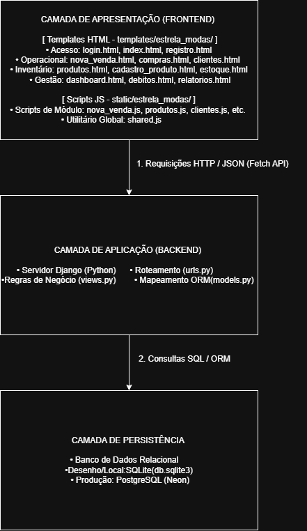

# Arquitetura do Sistema

## 1. Visão Geral

O sistema adota uma arquitetura em camadas bem definidas, separando a interface do utilizador, a lógica de negócio e o armazenamento de dados. A comunicação entre o frontend e o backend é realizada de forma assíncrona através de uma API REST.

---

## 2. Diagrama de Arquitetura

---

## 3. Descrição das Camadas

### 3.1. Camada de Apresentação (Frontend)
- **Tecnologias:** HTML5, CSS3 e JavaScript Vanilla.
- **Responsabilidade:** Renderização do painel de controlo, formulários de gestão (clientes, produtos, vendas) e envio de requisições assíncronas (HTTP/JSON) para a API.

### 3.2. Camada de Aplicação e Negócio (Backend)
- **Tecnologias:** Python 3.14 / Framework Django.
- **Responsabilidade:** Processamento de regras de negócio, autenticação, validação de dados de entrada e exposição dos endpoints da API REST.

### 3.3. Camada de Persistência (Banco de Dados)
- **Tecnologias:** SQLite (desenvolvimento) / PostgreSQL (produção).
- **Responsabilidade:** Armazenamento relacional dos dados de utilizadores, produtos, clientes e histórico de transações de vendas.

---

## 4. Requisitos de Infraestrutura
- Servidor web para execução do serviço Django.
- Pipeline de integração contínua configurada via GitHub Actions (`ci.yml`).
