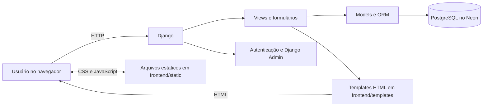
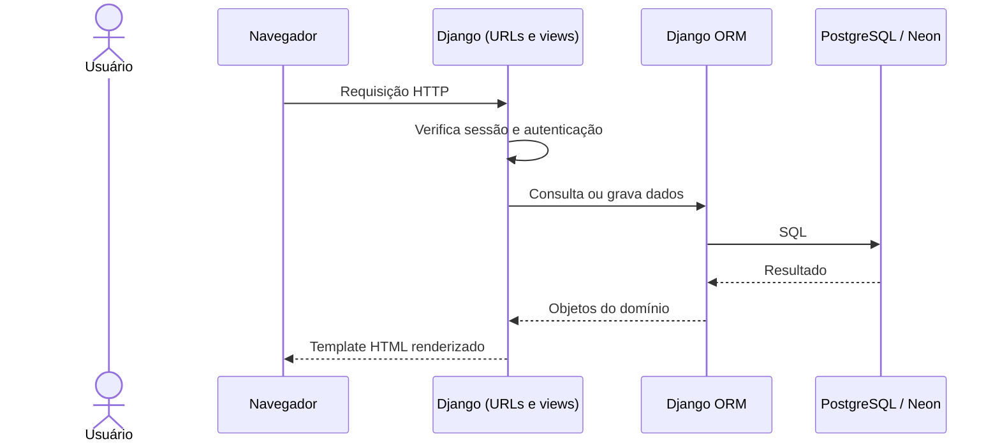

# Arquitetura inicial

> **Status:** arquitetura inicial do MVP, em desenvolvimento. Este documento descreve a organização implementada atualmente e pode evoluir conforme os requisitos forem validados.

## Visão geral

O sistema é uma aplicação web monolítica em Django. O Django recebe as requisições, aplica autenticação e regras de negócio, consulta ou atualiza o banco PostgreSQL e devolve páginas HTML renderizadas no servidor. CSS, imagens e JavaScript são servidos como arquivos estáticos.

O diretório `frontend/` separa os templates e arquivos de interface, mas não representa uma aplicação independente: os templates são renderizados pelo Django. Não há uma API REST nem um frontend SPA nesta arquitetura inicial.



## Organização dos diretórios

```text
raiz/
├── manage.py                  # Comandos de administração do Django
├── requirements.txt           # Dependências Python
├── config/                    # Configuração global do projeto
│   ├── settings.py            # Aplicativos, banco, templates, idioma e estáticos
│   ├── urls.py                # Rotas globais e Django Admin
│   ├── asgi.py                # Entrada ASGI
│   └── wsgi.py                # Entrada WSGI
├── estrela_modas/             # Aplicação de negócio do sistema
│   ├── models.py              # Entidades e relações persistidas
│   ├── forms.py               # Formulários e validações de entrada
│   ├── views.py               # Fluxos de páginas e regras de negócio
│   ├── urls.py                # Rotas da aplicação
│   ├── admin.py               # Integração dos modelos com Django Admin
│   └── migrations/            # Histórico versionado do esquema do banco
├── frontend/
│   ├── templates/estrela_modas/ # Páginas HTML renderizadas pelo Django
│   └── static/estrela_modas/    # JavaScript, CSS e outros arquivos estáticos
├── backend/                   # Arquivos locais de desenvolvimento
│   ├── .env                   # Configurações e credenciais locais; não versionar
│   └── venv/                  # Ambiente virtual Python; não versionar
├── docs/                      # Documentação do projeto
└── tests/                     # Testes e verificações do projeto
```

O diretório `backend/` não contém o código-fonte atual do Django; ele guarda arquivos locais de desenvolvimento. O banco configurado para a aplicação é escolhido por `DATABASE_URL`, não pela presença de um arquivo SQLite local.

## Camadas e responsabilidades

### Configuração (`config/`)

`settings.py` registra os aplicativos Django, middleware, autenticação, localização, templates e arquivos estáticos. As configurações sensíveis e específicas do ambiente são lidas de variáveis de ambiente, incluindo `SECRET_KEY` e `DATABASE_URL`. O projeto procura um `.env` na raiz e também em `backend/.env`.

`config/urls.py` inclui as rotas da aplicação e disponibiliza a administração em `/admin/`. `asgi.py` e `wsgi.py` são pontos de entrada para servidores compatíveis com esses padrões.

### Aplicação de negócio (`estrela_modas/`)

- **Models:** representam produtos, clientes, compras, itens de compra, movimentações de estoque, vendas, itens de venda, pagamentos de débitos, despesas e trocas.
- **Forms:** validam e organizam os dados recebidos da interface antes do processamento.
- **Views:** conduzem as operações e montam os dados enviados aos templates. As páginas operacionais exigem autenticação.
- **URLs:** associam endereços como `/produtos/`, `/estoque/`, `/vendas/nova/`, `/clientes/` e `/relatorios/` às views.
- **Migrations:** registram alterações estruturais dos models para que o esquema do banco possa ser atualizado de forma controlada.
- **Admin:** permite administrar modelos e usuários pela interface padrão do Django, conforme as permissões configuradas.

### Interface (`frontend/`)

O Django renderiza os arquivos HTML em `frontend/templates/`. A configuração de `STATICFILES_DIRS` disponibiliza os arquivos de `frontend/static/`, incluindo os scripts JavaScript das telas. A interação entre navegador e aplicação usa requisições HTTP e formulários HTML.

## Persistência e banco de dados

O banco principal previsto é PostgreSQL hospedado no Neon. A aplicação lê a conexão pela variável `DATABASE_URL`, usando `dj-database-url` e o driver `psycopg`. O arquivo `backend/.env` é destinado ao ambiente local e não deve ser enviado ao Git. Em outros ambientes, as variáveis devem ser fornecidas pela configuração do próprio ambiente.

O Django ORM mapeia os models para tabelas relacionais. A pasta `estrela_modas/migrations/` mantém as migrações da aplicação; as migrações dos componentes internos do Django criam, entre outras, as tabelas de usuários, permissões e sessões.

## Autenticação e fluxo de requisição

O projeto utiliza autenticação, sessões e permissões nativas do Django. A página de login é `/login/`; após autenticar, o usuário é encaminhado ao dashboard. As views protegidas redirecionam usuários não autenticados para o login. A criação da primeira conta administrativa é feita com `createsuperuser`, após aplicar as migrações ao banco configurado.



## Regras de negócio refletidas na arquitetura

- Compras, vendas e trocas podem gerar movimentações de estoque.
- Uma venda fiado precisa estar associada a um cliente.
- O formulário de vendas aceita vários itens e valida os dados recebidos.
- A aplicação registra pagamentos de débitos e despesas para consulta administrativa.

As regras são processadas no backend; JavaScript pode apoiar a interação das telas, mas não substitui as validações do servidor.

## Tecnologias

- Python e Django;
- Django Templates, HTML e JavaScript;
- PostgreSQL no Neon;
- `dj-database-url`, `psycopg` e `python-dotenv` para configuração e conexão;
- Git e GitHub para versionamento.

## Execução local

Os comandos abaixo são executados a partir da raiz do repositório no Prompt de Comando do Windows (CMD):

```cmd
backend\venv\Scripts\activate.bat
pip install -r requirements.txt
python manage.py migrate
python manage.py createsuperuser
python manage.py runserver
```

Antes de executar os comandos que acessam o banco, configure `SECRET_KEY` e `DATABASE_URL` no `.env` local. O servidor de desenvolvimento atende em `http://127.0.0.1:8000/` e serve apenas para desenvolvimento.

## Evolução prevista

Esta arquitetura é um ponto de partida para o MVP. Separação em API e frontend independente, controle mais granular de permissões, implantação de produção, estratégia de backups e monitoramento devem ser definidos quando houver requisitos para essas necessidades.
