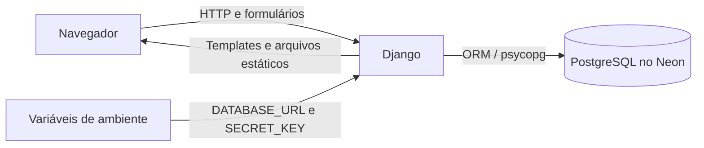

# Integrações

> **Status:** integrações iniciais do MVP. Este documento registra o que está conectado no código atual e o que ainda depende de decisão ou implementação.

## Visão geral

Atualmente, o sistema integra o Django a um banco PostgreSQL hospedado no Neon. A interface se comunica com o próprio Django por requisições HTTP: as páginas são renderizadas no servidor e os arquivos JavaScript e CSS são servidos pela aplicação. Não foi identificada, no código atual, integração com APIs externas de pagamento, envio de e-mail, mensageria, autenticação social ou armazenamento de arquivos em nuvem.

| Integração | Finalidade | Tecnologia / configuração | Estado |
| --- | --- | --- | --- |
| Banco de dados Neon | Persistir usuários e dados comerciais | PostgreSQL, Django ORM, `dj-database-url` e `psycopg`; variável `DATABASE_URL` | Configurada para uso pelo projeto |
| Interface web | Enviar formulários e apresentar dados do sistema | Django Templates, HTML e JavaScript local; rotas Django | Integrada ao backend |
| Autenticação e administração | Login, sessões, permissões e administração dos registros | Aplicativos nativos `django.contrib.auth`, `sessions` e `admin` | Integrada; usa o mesmo banco configurado |

## PostgreSQL no Neon

O Django abre a conexão PostgreSQL a partir da variável `DATABASE_URL`. A biblioteca `dj-database-url` interpreta a URL e o driver `psycopg` realiza a comunicação com PostgreSQL. As operações de negócio usam o ORM do Django; não há chamadas diretas à API administrativa do Neon.

### Configuração por ambiente

- Em desenvolvimento, configure `DATABASE_URL` e `SECRET_KEY` no arquivo local `.env` da raiz ou em `backend/.env`.
- Em hospedagem, configure essas variáveis no serviço que executa a aplicação, usando o gerenciador de segredos da plataforma.
- Mantenha credenciais reais fora do Git e nunca as inclua em documentação, logs ou exemplos versionados.
- A conexão está configurada para exigir SSL.

O código carrega primeiro o `.env` da raiz e depois tenta carregar `backend/.env`. Variáveis que já existam no ambiente do processo têm prioridade sobre os valores dos arquivos.

### Migrações do esquema

As alterações nos models da aplicação são registradas em `estrela_modas/migrations/`. O comando `python manage.py migrate` aplica ao banco as migrações pendentes dos aplicativos Django e do projeto. A primeira conta administrativa é criada com `python manage.py createsuperuser` depois da existência das tabelas de autenticação.

Se `showmigrations` indicar uma migração aplicada, mas uma tabela esperada não existir, confirme que `DATABASE_URL` aponta para o projeto, branch, banco e schema corretos do Neon. O histórico de migrações e as tabelas precisam pertencer ao mesmo banco/schema. Não remova tabelas nem o histórico de migrações sem avaliar os dados existentes.

## Interface e comunicação HTTP

O navegador envia requisições às rotas Django, e o servidor devolve HTML renderizado com os dados consultados pelo ORM. Os scripts em `frontend/static/estrela_modas/` apoiam a interação das páginas. Nesta versão, não há uma API REST pública nem um frontend separado que consuma endpoints de terceiros.

Formulários protegidos usam o mecanismo CSRF padrão do Django. A autenticação usa sessões mantidas pelo Django; os dados de sessão são persistidos no banco configurado.

## Integrações ainda não implementadas

As seguintes integrações não aparecem no código atual e exigem requisitos, credenciais e implementação próprios antes de serem consideradas disponíveis:

- gateways ou links de pagamento;
- envio de e-mail ou mensagens;
- login com provedores externos (OAuth/SSO);
- API REST para clientes externos ou aplicativo móvel;
- armazenamento de imagens e documentos fora do servidor;
- monitoramento de erros e métricas externas.

## Dependências relacionadas

As bibliotecas da conexão e carregamento de configuração estão em `requirements.txt`:

- `dj-database-url`: conversão de `DATABASE_URL` para a configuração de banco do Django;
- `psycopg[binary]`: driver PostgreSQL;
- `python-dotenv`: leitura dos arquivos `.env` no desenvolvimento local.

## Fluxo resumido

